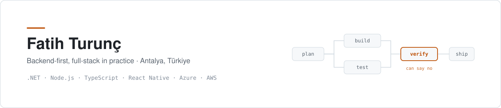

<picture>
  <source media="(prefers-color-scheme: dark)" srcset="banner-dark.svg">
  
</picture>

  
  
  
  
  
  
  
  
  

**Architecture** &nbsp; Domain-driven design · TDD · microservices where the boundaries are real, a monolith where they are not &nbsp;·&nbsp; feature-based structure on mobile

**Data** &nbsp; Relational and document stores &nbsp;·&nbsp; caching layers &nbsp;·&nbsp; search

**Integrations** &nbsp; POS and payment systems, third-party APIs — the work where a retry has to be idempotent and a mismatch is somebody's money

Most of my time now goes into multi-agent systems — how to structure an agent team
so that **something other than the author checks the work.** That is the diagram
above, and the pinned repositories below are the work: the machinery, the method,
and two applications of it.

<a href="https://www.linkedin.com/in/fatih-turunc">LinkedIn</a> &nbsp;·&nbsp; Rehberlerin Türkçe sürümleri repoların içinde.
